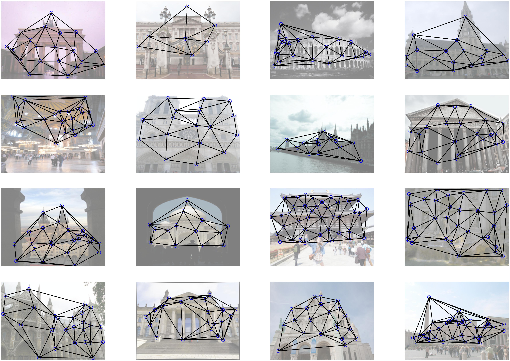

# IMCPT-SparseGM

IMCPT-SparseGM dataset is a new visual graph matching benchmark addressing partial matching and graphs with larger sizes, based on the novel stereo benchmark [Image Matching Challenge PhotoTourism  (IMC-PT)  2020](https://www.cs.ubc.ca/research/image-matching-challenge/2020/). This dataset is released in CVPR 2023 paper [*Deep Learning of Partial Graph Matching via Differentiable Top-K*](https://openreview.net/forum?id=4OoXQPGd1s).

A comparison of existing vision graph matching datasets is presented:

#### Comparison of Existing Vision Graph Matching Datasets

| **dataset name**        | **# images** | **# classes** | **avg # nodes** | avg # edges | **# universe** | **partial rate** | best-known f1                                       |
| ----------------------- | ------------ | ------------- | --------------- | ----------- | -------------- | ---------------- | --------------------------------------------------- |
| **CMU house/hotel**     | 212          | 2             | 30              | \           | 30             | 0.0%             | 100% (learning-free, RRWM, ECCV 2012)               |
| **Willow ObjectClass**  | 404          | 5             | 10              | \           | 10             | 0.0%             | 97.8% (unsupervised learning, GANN, PAMI 2023)      |
| **CUB2011**             | 11788        | 200           | 12.0            | \           | 15             | 20.0%            | 83.2% (supervised learning, PCA-GM, ICCV 2019)      |
| **Pascal VOC Keypoint** | 8702         | 20            | 9.07            | \           | 6 to 23        | 28.5%            | 62.8% (supervised learning, BBGM, ECCV 2020)        |
| **IMC-PT-SparseGM-50**  | 25765        | 16            | 21.36           | 54.71       | 50             | 57.3%            | 72.9% (supervised learning, GCAN-AFAT-I, CVPR 2023) |
| **IMC-PT-SparseGM-100** | 25765        | 16            | 44.48           | 123.99      | 100            | 55.5%            | 71.5%(supervised learning, GCAN-AFAT-U, CVPR 2023)  |

The classes and number of images in each class are also presented:

#### Number of images in each class

| class name | brandenburg\_gate | grand\_place\_brussels | palace\_of\_westminster | reichstag* | taj\_mahal | westminster\_abbey | buckingham\_palace | hagia\_sophia\_interior | pantheon\_exterior | sacre\_coeur* | temple\_nara\_japan | colosseum\_exterior | notre\_dame\_front\_facade | prague\_old\_town\_square | st\_peters\_square* | trevi\_fountain |
| ---------- | ----------------- | ---------------------- | ----------------------- | ---------- | ---------- | ------------------ | ------------------ | ----------------------- | ------------------ | ------------- | ------------------- | ------------------- | -------------------------- | ------------------------- | ------------------- | --------------- |
| # images   | 1363              | 1083                   | 983                     | 75         | 1312       | 1061               | 1676               | 889                     | 1401               | 1179          | 904                 | 2063                | 3765                       | 2316                      | 2504                | 3191            |

\* refers to test class.


A visualization of 3D point cloud labels provided by **the original IMC-PT (blue)** and our selected anchor points for graph matching in **IMC-PT-SparseGM (red)**:


A visualization of graph matching labels from **IMC-PT-SparseGM**:


A visualization of visual graphs in each class from **IMC-PT-SparseGM**:




### IMCPT-SparseGM-generator

This generator creates IMCPT-SparseGM based on Image_Matching_Challange_Data.

Note that you should install colmap and download [Image_Matching_Challange_Data](https://www.cs.ubc.ca/~kmyi/imw2020/data.html) before you create IMCPT-SparseGM by just running 
    python dataset_generator.py

Arguments are the following:

    --root             'source dataset directory'                             default='Image_Matching_Challange_Data'
    --out_dir          'output dataset directory'                             default='picture'
    --pt_num           'universal point number to be selected'                default=50
    --min_exist_num    'min num of img an anchor exists in'                   default=10
    --dis_rate         'min distance rate when selecting points'              default=1.0
    --exist_dis_rate   'min distance rate when judging anchors\' existence'   default=0.75

Then the adjacency matrix can be generated and saved in annotation files by running

​    python build_graphs.py

Arguments are the following:

    --anno_path            'dataset annotation directory'                             default='data/IMC-PT-SparseGM/annotations'
    --stg   'strategy of graph building, tri or near or fc'   default='tri'

We provide the download links of IMC-PT-SparseGM-50 and IMC-PT-SparseGM-100, i.e., IMC-PT-SparseGM with annotations of 50 and 100 anchor points from [google drive](https://drive.google.com/file/d/1C3xl_eWaCG3lL2C3vP8Fpsck88xZOHtg/view?usp=sharing) or [baidu drive (code: g2cj)](https://pan.baidu.com/s/1ZQ3AMqoHtE_uA86GPf2h4w) or [hugging face](https://huggingface.co/datasets/esflfei/IMC-PT-SparseGM).

You can also generate IMC-PT-SparseGM annotations by your demands (such as setting ``pt_num`` to 200), using IMC-PT-SparseGM generator.


Please cite the following papers if you use IMC-PT-SparseGM dataset:

```
@article{JinIJCV21,
  title={Image Matching across Wide Baselines: From Paper to Practice},
  author={Jin, Yuhe and Mishkin, Dmytro and Mishchuk, Anastasiia and Matas, Jiri and Fua, Pascal and Yi, Kwang Moo and Trulls, Eduard},
  journal={International Journal of Computer Vision},
  pages={517--547},
  year={2021}
}

@unpublished{WangCVPR23,
  title={Deep Learning of Partial Graph Matching via Differentiable Top-K},
  author={Runzhong Wang*, Ziao Guo*, Shaofei Jiang, Xiaokang Yang, Junchi Yan},
  booktitle={CVPR},
  year={2023}
}
```
